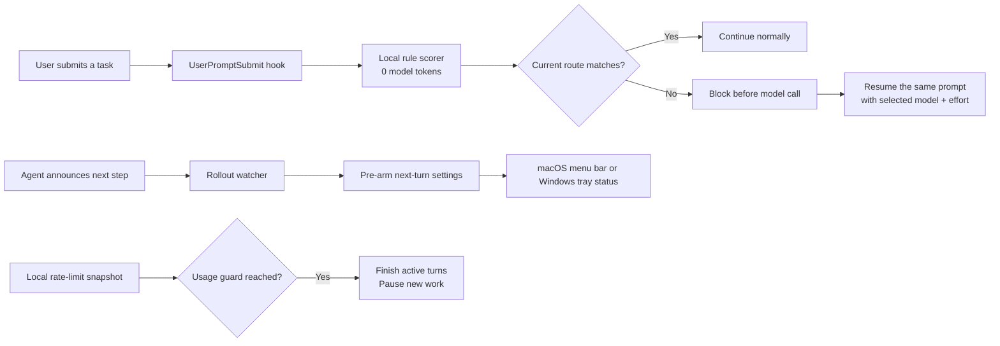

# Codex Adaptive Model Router

[](https://github.com/hadongil19822-blip/codex-adaptive-model-router/actions/workflows/test.yml)
[](LICENSE)
[](https://www.apple.com/macos/)
[](https://www.microsoft.com/windows/)

**A zero-token, local model router for Codex Desktop.** It selects Luna, Terra, or Sol and the reasoning effort for each task, then shows every active task in a macOS menu bar or Windows system-tray dashboard.

> 한국어 사용자는 [README.ko.md](README.ko.md)를 참고하세요.

## Why

Using the strongest model for every request wastes quota. Always using the cheapest model often creates retries that waste even more. This project estimates task complexity locally and routes each request to the lowest-cost model and effort likely to finish it reliably.

No classifier model is called. Routing uses transparent regular expressions, task length, failures, tool output size, and context pressure.

## Highlights

- **Routes every prompt** through Codex's official `UserPromptSubmit` lifecycle hook.
- **Spends zero model tokens on classification** because all decisions are local.
- **Uses 12 cost bands** across Luna, Terra, and Sol.
- **Pre-arms announced follow-up work** before the next turn starts.
- **Monitors multiple Codex tasks independently.**
- **Shows weekly Codex quota remaining** without spending model tokens.
- **Offers an opt-in usage guard** that pauses new work at a configurable threshold.
- **Protects attachments, explicit model choices, and subagent sessions** from unsafe rerouting.
- **Ships with a native SwiftUI menu bar monitor** for macOS.
- **Ships with a dependency-free PowerShell/WinForms tray monitor** for Windows.
- **Keeps routing rules editable** in one JSON file.

## Routing policy

| Workload | Default family | Typical effort |
| --- | --- | --- |
| Short lookup, explanation, formatting | Luna | low–high |
| Everyday editing, implementation, validation | Terra | low–high |
| Complex automation, repeated failures, high-risk work | Sol | low–max |
| Explicit parallel, multi-agent, exhaustive work at the highest score | Sol | ultra |

Ultra is intentionally rare because it can delegate work and consume substantially more tokens. The included catalog reflects the model combinations available in the Codex build used during development; edit `router_config.json` if your installation exposes different models.

## How it works



The follow-up pre-arm path first uses Codex app-server's `thread/settings/update` method. On macOS, an internal Desktop IPC path remains as a compatibility fallback. Failed pre-arms fall back to notifications and turn-boundary behavior.

## Requirements

- macOS 13 or later, or Windows 10/11
- Codex Desktop / Codex CLI with lifecycle hooks enabled
- Python 3.9 or later
- Xcode Command Line Tools only for the optional macOS menu bar app
- Windows PowerShell 5.1 or later for the Windows tray app

## Quick start

```bash
git clone https://github.com/hadongil19822-blip/codex-adaptive-model-router.git
cd codex-adaptive-model-router
chmod +x install.sh macos-widget/build-widget.sh codex-auto
./install.sh
```

Codex requires a one-time trust review for user hooks:

1. Open Codex CLI.
2. Run `/hooks`.
3. Review and trust the `UserPromptSubmit` hook.

The installer starts the watcher and places the optional app at:

```text
~/Applications/Codex Auto Router.app
```

### Windows

Open PowerShell in the cloned repository and run:

```powershell
Set-ExecutionPolicy -Scope Process Bypass
.\install.ps1
```

The installer starts the watcher, opens the tray dashboard, and creates `Codex Auto Router.lnk` on the desktop. No third-party UI package is required.

## Commands

```bash
./codex-auto watch --all --daemon
./codex-auto status
./codex-auto status --json
./codex-auto usage
./codex-auto decide "Refactor these three files and run the tests"
./codex-auto stop
```

## Customize it

Your live configuration is stored at:

```text
~/.codex/auto-router/router_config.json
```

Change route thresholds, model slugs, supported efforts, cooldowns, notification behavior, or prompt rerouting without editing Python. The installer preserves an existing live configuration on upgrade.

The dashboard also exposes an opt-in weekly usage guard. Its default is off. When enabled and the remaining weekly quota reaches the selected threshold, active turns are allowed to finish safely while new prompts and automatic follow-ups are paused. The watcher refreshes the local quota snapshot every five minutes; this status check does not call a model or consume model tokens.

For pattern changes and new task categories, see [Customization Guide](docs/CUSTOMIZATION.md). For internal flow and safety boundaries, see [Architecture](docs/ARCHITECTURE.md).

## Safety and privacy

- Prompt classification happens on-device.
- The router does not send analytics or prompts to a third-party service.
- Prompt text is only written where Codex already stores its local transcript, plus a short-lived `0600` reroute request file that is deleted after resumption.
- Image, audio, and video attachment turns are not automatically resubmitted.
- Subagent and guardian sessions are not rerouted.
- A model explicitly named in the prompt is respected.
- Active turns are not interrupted by the watcher.

Read [SECURITY.md](SECURITY.md) before enabling this on sensitive or production work.

## Current limitations

- Model slugs and effort availability can change between Codex releases.
- The default UI language is English; Korean task classification remains supported.
- Windows tray support requires the desktop PowerShell process to keep running, just like the macOS menu bar process.
- Prompt rerouting relies on `codex exec resume`; if resumption fails, the router logs the error and sends a recommendation notification.
- This is an independent community project, not an official OpenAI product.

## Contributing

Issues and pull requests are welcome. Start with [CONTRIBUTING.md](CONTRIBUTING.md).

If this saves you quota or retries, consider starring the repository—it helps other Codex users discover it. ⭐

## License

[MIT](LICENSE)
